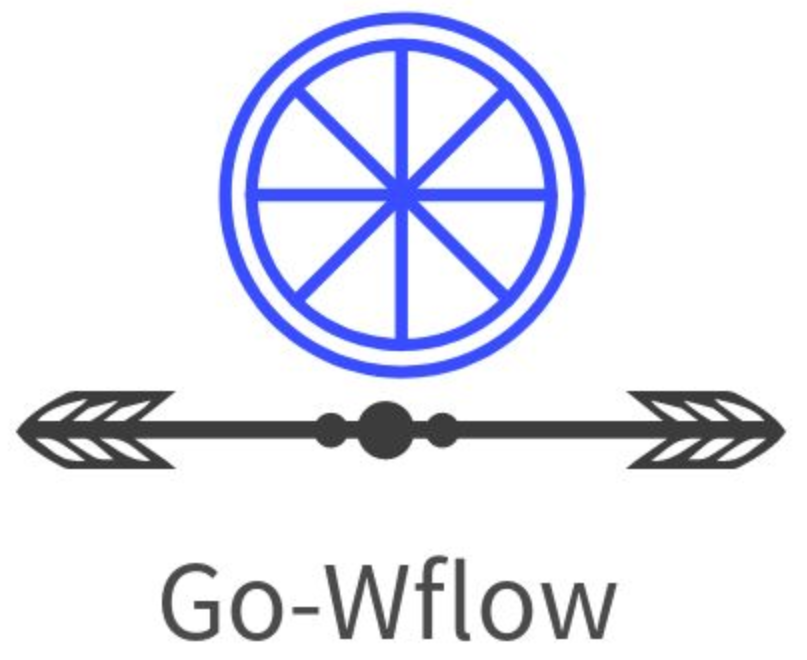

# go-wflow

<div align=center>


<br/>


[](https://github.com/qkbyte/go-workflow/blob/ling/LICENSE)

</div>

奥集能3.0平台待办工作流，运用DDD设计思想，集平台权限管理和代码快速生成于一体，go-zero与ent深度结合的低代码平台，api和rpc高度解耦，灵活高效，组件化，配置化，打造集流程设计、流程部署、流程执行、任务办理、流程监控于一体的强大工作流平台，力争成为开源流程引擎的标杆。

> 区别于传统Bpmn自带流程设计器，传统设计器晦涩难懂，对于普通企业用户使用门槛偏高，没有经过专业培训根本无从下手，需要相关专业人员辅助来创建流程。而本设计器界面简单，符合普通大众的思维逻辑，易于理解和上手使用。

## 特性
- 👏 go-zero 是一个集成了各种工程实践的 web 和 rpc 框架。通过弹性设计保障了大并发服务端的稳定性，经受了充分的实战检验。
- 💪 ent是一个简单但功能强大的Go实体框架，它使构建和维护大型数据模型的应用程序变得容易。

## 功能

* 流程设计
* 流程预处理
* 流程发起
* 流程审批
* 流程传阅
* 查看流程图
* 流程撤回
* 我的待办/已完成/未完成/待我审批/我已审批
* 查询审批超时流程
* 条件节点

## 后续工作


* 1、平台对接☆☆☆
* 2、审批驳回☆☆
* 3、抄送（转发）
* 4、审批人（抄送人）为岗位
* 5、审批时可以上传附件
* ~~6、条件节点☆☆~~
* 7、并行流程☆☆
* 8、触发器
* 9、流程查询


## 目录介绍

```
.
├── app
│	├── wflow
│   	├── api api、rpc生成文件
│    	├── rpc api调用rpc，rpc调用wflow里面的具体业务
├── bin
├── common
│	├── cache
│	├── flow 
│	├── models
│	├── resp
│	├── store
│	├── utils
├── doc
│	├── swagger
├── kernel
│	├── core 业务处理
│		├── wflow
│	├── ent 数据库操作
├── script
├── source
│	├── api api、rpc源文件
│   ├── rpc
│   ├── schema ent源文件
├── test
```

## git规范
```
● add/feat：新功能
● fix：bug修复
● update：更新
● del：移除文件
● docs：文档改变
● style：代码格式改变
● perf：性能优化
● test：添加测试代码
● revert：撤销上一次的commit
● refactor：某个已有功能重构
● build：构建工具或构建过程的变动
```

## ent代码生成
```
【注意】 目录在根目录 02_code/atest/go-workflow-ling

1.根据需求更改kernel/ent/schema或source/ent/schema文件内容，两个内容必须相同，source/ent/schema是备份

2.kernel/ent/schema/generate.go文件生成ent代码

3.通过ent message 生成rpc内容，复制到source/rpc/message.proto文件里面，【注意】头部信息勿删除
ent message ./kernel/ent/schema/

4.生成rpc kernel/message.pb.go文件
protoc --go_out=. --go_opt=paths=import source/rpc/message.proto
```

## go-zero api rpc生成代码命令
```
目录：README.md根目录下生成

goctl api go -api source/api/wflow.api -dir app/wflow/api

./common/resp/apiResp.go文件复制到./app/wflow/api/internal/types目录里面。

目录：README.md根目录下生成

goctl rpc protoc source/rpc/wflow.proto --go_out=. --go-grpc_out=. --zrpc_out=./app/wflow/rpc/ --style=goZero

备注：./kernel会添加两个文件wflow_grpc.pb.go和wflow.pb.go

1.github.com/zeromicro全部替换github.com/qkbyte

2.go mod tidy

3.修改go-workflow-ling\app\wflow\rpc\wflow\wflow.go
	Wflow interface {}上面添加，下面三行
	
    Procdef       		= kernel.Procdef
	ProcdefArray        = kernel.ProcdefArray
	Procinst       		= kernel.Procinst

4.go mod tidy

5.生成数据库
新建数据库，库名：wflow
目录test/a_test.go ，执行TestDbCreateTable()方法

6.修改api和rpc 代码逻辑，开始调试~~~
调用顺序：api-->rpc-->kernel,kernel具体业务逻辑实现
aip端口:8080 rpc端口：8081

```


